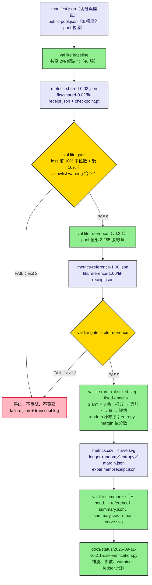

# vision-active-learning-loop

RT-DETR（`PekingU/rtdetr_r18vd`）在 RDD2022 Czech 道路損壞資料上的 active learning 選樣策略比較。固定標註預算下比較 random、entropy、margin、core-set、hybrid 五種策略；三個 seed、預先登記的判定規則、每個 fit 一份收據。第一輪比較已於 2026-09-12 完成，沒有進行中的實驗。

## 摘要

- entropy、margin、hybrid 對 random 的配對 nAUBC 差在三個 seed 都為正；core-set 只有兩個 seed 為正，依規則記為不一致。
- 20% 預算時，entropy 達全標籤參考基線的 0.53–0.63、margin 0.49–0.57、random 0.30–0.45。
- 一個負面結果：v0.2-lite 觀察到的 20% 最低類別 recall 分離，換成固定 epoch 規則後消失。
- 撐得住的是正負號一致，不是量值：配對差與同機重播差同一數量級（12 對重播，最大 0.0075）。


動畫的數字讀自 `docs/results/` 的 summary 與收據；它只做說明，不是證據。

## 1. 實驗設計

| 項目 | 設定 |
|---|---|
| 資料 | RDD2022 Czech train 子樹 2,829 張、1,745 框；凍結 test 574 張，pool 2,255 張 |
| 模型 | RT-DETR r18vd，pinned revision 與 safetensors SHA-256；四類輸出頭重設後訓練 |
| 起點與預算 | 共享 2% 起點 46 張；預算 5%、10%、20% = 113、226、451 張，巢狀 |
| 策略 | random（凍結序）；entropy、margin（逐 query 不確定度）；core-set（DINOv2-small 向量、貪婪 k-center）；hybrid（entropy 篩 5 倍候選後 k-center） |
| 訓練規則 | A `fixed-steps`：每個 fit 1,000 步；B `fixed-epochs`：18 個 epoch，最低 200 步 |
| 指標 | 凍結 test 的 mAP50–95；主要比較量是同一次實驗內 arm − random 的配對 nAUBC 差 |
| 判定 | 三個 seed（17、29、43）正負號一致才稱一致；最大／最小只稱範圍，不做區間估計 |
| 登記 | 每輪的規則、常數與判定條件在看到結果前寫定，之後不改 |

`val lite` 各命令與產出檔：



v0.3 在同一條路徑上加 `val lite embed`（pool 向量算一次、存檔）與 `--arms random,coreset,hybrid`；core-set 與 hybrid 的 ledger 記錄 k-center 距離與候選名單。

## 2. 結果

| 輪 | 規則 | 比較 | 結果 |
|---|---|---|---|
| v0.2-lite（2026-09-09） | A | entropy、margin vs random | 各 3/3 為正 |
| v0.2.1（2026-09-11） | B，加全標籤參考基線 | entropy、margin vs random | 各 3/3 為正；20% 相對參考基線 entropy 0.53–0.63、margin 0.49–0.57、random 0.30–0.45 |
| v0.3（2026-09-12） | B | core-set、hybrid vs random | hybrid 3/3；core-set 2/3，不一致 |

絕對表現仍低：20% 預算最高 mAP50–95 0.041，全標籤參考基線 0.066（規則 B）。相同影像數下，各 arm 揭露的框數與負樣本數不同，各輪報告有逐設定的計數。

## 3. 可重現性與驗證

- 每個 fit 一份收據：步數與 epoch、`grid_sampler_2d_backward_cuda` warning 數（須恰為 9）、SDPA backend（MATH）、模型與 checkpoint 的 SHA-256、manifest 雜湊。
- `docs/status/` 的核對腳本從證據磁碟重算全部檢查；v0.3 的 core-set 與 hybrid 選樣可從存檔向量逐筆重放。
- 不宣稱 deterministic 或跨機可重現。原 Wave 0 的 gate 在位元界限下 FAIL，差異歸因到 `grid_sampler_2d_backward_cuda`；lite 研究不再要求位元相同，改以同機重播差作為量值尺度。
- 收據、checkpoint 與逐字紀錄不進 git，放在 repo 之外的私有證據目錄（文件中寫作 `<evidence-root>`），另有一份逐檔雜湊核對過的備份。

## 4. 執行

本機路徑不寫進 repo：複製 `scripts/local-paths.example.ps1` 為 `scripts/local-paths.ps1`（git 忽略）並填入 `<evidence-root>`、`<data-root>` 等位置；啟動器從它取得預設值，核對腳本讀它設定的 `VAL_EVIDENCE_ROOT` 與 `VAL_DATA_ROOT`。以下命令都在 repo 根目錄執行。

CPU 測試（不做 GPU 運算，但 checkpoint 載入器會讀 CUDA RNG 狀態，需看得到一顆 GPU）：

```powershell
.venv\Scripts\python.exe -m pytest -q -p no:cacheprovider
```

2026-09-15：999 passed、17 skipped、0 failed，約 2.5 分鐘。沒有 `pwsh` 時兩個 Wave 0 啟動器測試檔整檔 skip。

GPU 實驗只有一個啟動點 `scripts/run_lite_seed17.ps1`。先 dry-run，只檢查輸入，不啟動：

```powershell
powershell -ExecutionPolicy Bypass -File scripts\run_lite_seed17.ps1 -DryRun
```

正式執行依輪加參數；`-Seed 29`、`-Seed 43` 換 seed；`-WaitForGpu` 在 GPU 忙碌時每 30 秒等一次，最多 4 小時：

| 輪 | 參數 |
|---|---|
| v0.2-lite | `-WaitForGpu` |
| v0.2.1 | `-WaitForGpu -Rule fixed-epochs -Reference` |
| v0.3 | `-WaitForGpu -Rule fixed-epochs -Arms random,coreset,hybrid`（embeddings 路徑來自 local-paths） |

v0.3 的向量先算一次（GPU 約 1 分鐘）：

```powershell
.venv\Scripts\val.exe lite embed --manifest "<evidence-root>\lite\data\czech\manifest.json" --images "<data-root>\rdd2022\czech\images" --snapshot "<evidence-root>\wave0\model_cache\snapshots\facebook--dinov2-small\ed25f3a31f01632728cabb09d1542f84ab7b0056" --output-dir "<evidence-root>\lite\data\czech" --device cuda
```

啟動器依序跑 2% 基線 → gate →（參考基線 → gate）→ 完整實驗（10 個 fit）。任一階段失敗即停，不重試、不覆寫；退出碼 2 為階段失敗、3 為 preflight 或 `RUNNING.lock`、4 為 GPU 忙碌。輸出在 `<evidence-root>\lite\` 的 `lite-czech-…\` 與 `run-lite-…log`；基線失敗時另寫 `failure.json`。不要同時開第二份。

磁碟核對：先 `. .\scripts\local-paths.ps1`，再執行 `.venv\Scripts\python.exe docs\status\2026-09-11-v0.3-disk-verification.py`（v0.2.1 同理）。

## 5. 限制

- 不宣稱降低人工標註成本：沒有量測標註時間，各 arm 揭露的框數不同。
- 不宣稱 deterministic 或跨機可重現；三個 seed 的最大／最小只是範圍。
- 最低類別 recall 不下結論；5% 預算兩種規則都無優勢。
- 秒數不可比：執行期間與其他專案共用 GPU。
- 原 8-wave 協定要求 Wave 0 PASS 才能碰資料，Wave 0 至今沒有 PASS；lite 研究依 2026-09-09 的復活評估另行界定前提，兩者的驗證範圍分開保留。
- 本 repo 不放影像、標註、權重、checkpoint。程式碼 Apache-2.0；資料以 CC BY-SA 4.0 對待；模型授權由 `assets verify` 的登記檔記錄。

## 6. 文件

| 文件 | 內容 |
|---|---|
| [docs/results/2026-09-12-v0.3-diversity.md](docs/results/2026-09-12-v0.3-diversity.md) | v0.3 結果：core-set、hybrid、重播尺度、還不能宣稱什麼 |
| [docs/results/2026-09-11-v0.2.1-training-rule.md](docs/results/2026-09-11-v0.2.1-training-rule.md) | v0.2.1 結果：兩種訓練規則、參考基線、負面結果 |
| [docs/results/2026-09-09-lite-czech-three-seeds.md](docs/results/2026-09-09-lite-czech-three-seeds.md) | v0.2-lite 結果 |
| [docs/results/](docs/results/) | 每個實驗與參考基線一個目錄；每輪一個 `summary-*/` |
| [docs/superpowers/specs/2026-09-11-val-v0.3-diversity-protocol.md](docs/superpowers/specs/2026-09-11-val-v0.3-diversity-protocol.md) | v0.3 協定 |
| [docs/superpowers/specs/2026-09-10-val-v0.2.1-training-rule-protocol.md](docs/superpowers/specs/2026-09-10-val-v0.2.1-training-rule-protocol.md) | v0.2.1 協定 |
| [docs/superpowers/specs/2026-09-09-val-v0.2-lite-protocol.md](docs/superpowers/specs/2026-09-09-val-v0.2-lite-protocol.md) | v0.2-lite 協定，含可重現性宣稱的措辭 |
| [docs/status/2026-09-11-v0.3-disk-verification.py](docs/status/2026-09-11-v0.3-disk-verification.py) | v0.3 磁碟核對，含選樣重放；同名 `.json` 為輸出 |
| [docs/status/2026-09-11-v0.2.1-disk-verification.py](docs/status/2026-09-11-v0.2.1-disk-verification.py) | v0.2.1 磁碟核對；同名 `.json` 為輸出 |
| [docs/status/2026-09-10-lite-sanity-audit.md](docs/status/2026-09-10-lite-sanity-audit.md) | 開跑前的 CPU sanity audit 與同機重播對照 |
| [docs/status/2026-09-15-closure.md](docs/status/2026-09-15-closure.md) | 收尾：關閉的範圍、備份、公開前檢查 |
| [docs/status/2026-09-09-revival-assessment.md](docs/status/2026-09-09-revival-assessment.md) | 從 Wave 0 到 lite 研究的評估 |
| [docs/data-card.md](docs/data-card.md) | 資料來源、雜湊、計數、授權 |
| [docs/diagrams/](docs/diagrams/) | Mermaid 圖源：pipeline、啟動器時序、證據鏈 |
| [docs/media/manim/](docs/media/manim/) | 動畫專案；長版（110 秒，1080p60）在 [Release v0.3.0](https://github.com/kuotunyu/vision-active-learning-loop/releases/tag/v0.3.0) |
| [docs/superpowers/specs/2026-08-23-vision-active-learning-loop-design.md](docs/superpowers/specs/2026-08-23-vision-active-learning-loop-design.md) | 原 8-wave 設計規格；計畫索引在同層 `plans/` |
