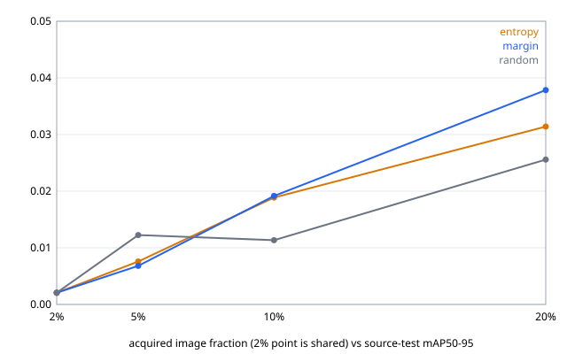

# 結果：v0.2-lite，RDD2022 Czech，seed 17（2026-09-09）

這是本專案第一輪真正跑完的「基線 → 選樣 → 加入標註 → 重訓 → 同測試集比較」。實驗 id `lite-czech-s17-20260909T1002Z`，在 RTX 4090 上 10:53Z 開始、11:40Z 結束（2,857 秒），10 個 fit 全部完成，退出碼 0。

可核對的檔案在 [lite-czech-s17-20260909T1002Z/](lite-czech-s17-20260909T1002Z/)：`metrics.csv`、`curve.svg`、三個 `ledger-<arm>.json`、`experiment-receipt.json`，以及同一個時間戳、先跑的獨立基線 `baseline-run-metrics-shared-0.02.json`。checkpoint（10 × 230 MB）與逐字紀錄留在私有證據根目錄，不進 Git。

## 設定

| 項目 | 值 |
|---|---|
| 資料 | Czech train 子樹，manifest `3d961040…9388d`；pool 2,255、test 574（見 [data-card](../data-card.md)） |
| 模型 | `PekingU/rtdetr_r18vd` @ `cc5b50f3…`，四類 reset（seed 17） |
| 預算 | 2% = 46（共享起點）、5% = 113、10% = 226、20% = 451，巢狀 |
| arm | random、entropy、margin |
| 每個 fit | 1,000 步、batch 8、BF16、AdamW 1e-4／1e-5、clip 0.1、Math-only SDPA、A3 allowlist backward |
| 評估 | pycocotools mAP50–95 於凍結 test 574 張，前 100 偵測、無 NMS、無門檻 |

## 核對結果（從磁碟驗證，非螢幕）

- 10 個 checkpoint 的 SHA-256 與 fit 收據、實驗收據三方一致。
- 每個 fit：loss 前 10% 步中位數 > 後 10%；`grid_sampler_2d_backward_cuda` warning 恰 9 個；`sdpa_backend = MATH`；峰值 VRAM 3.39 GiB。
- 三個 ledger 各 405 筆，每輪 67／113／225 筆，item_id 不重複；random 無分數，entropy／margin 全有分數。
- 策略只看得到無標籤的 pool 列；test 從未進入訓練或選樣（排程測試以注入的 fitter／scorer 釘住此性質）。

## 指標（source-test mAP50–95）

| arm | 2%（共享） | 5% | 10% | 20% | nAUBC | 對 random |
|---|---:|---:|---:|---:|---:|---:|
| random | 0.0021 | 0.0123 | 0.0113 | 0.0256 | 0.01472 | — |
| entropy | 0.0021 | 0.0076 | 0.0189 | 0.0314 | 0.01845 | +0.00372 |
| margin | 0.0021 | 0.0068 | 0.0192 | 0.0378 | 0.02018 | +0.00545 |

AP50 在 20%：random 0.086、entropy 0.104、margin 0.122。最低類別 recall 在 20%：random 0.115、entropy 0.239、margin 0.300。完整逐類數字在 `metrics.csv`。

## 這些數字能說什麼、不能說什麼

**能說的**：在這台機器、這個 seed、這個資料子集上，兩個不確定性 arm 在 10% 與 20% 預算都高於 random，nAUBC 分別高 0.0037 與 0.0055；margin 的最低類別 recall 在 20% 是 random 的 2.6 倍。流程是完整且可核對的。

**不能說的，而且要明講**：

1. **一個 seed 的差距落在同機重播離散度之內。** 同一個 46 張共享起點、同一 recipe，獨立跑的基線 mAP 是 0.0071，實驗內的共享 fit 是 0.0021。這個差來自 CUDA `grid_sample` backward 的 atomicAdd 累加順序（v0.1 §5.2.15 已歸因），量級與 arm 之間的差相同。所以「entropy／margin 優於 random」目前只是方向一致的觀察，不是結論。協定 §7 的措辭已經禁止更強的說法。要把它變成結論需要 seed 29、43（協定已登記為選做）。
2. **絕對 mAP 很低（≤ 0.04）。** 這是 1,000 步、最多 451 張、62% 負樣本、未調 LR 的必然結果，不是可用的偵測器。相對比較仍成立，但不要把這條曲線當成 RDD 的效能報告。
3. **固定步數讓預算與 epoch 數混淆。** 46 張跑 1,000 步約 170 個 epoch，451 張約 18 個 epoch；fit 收據的末段 loss 中位數從 4.5（2%）升到 10.6（20%）就是這個現象。這是 v0.2-lite §3 的設計取捨，v0.2.1 應改為「固定 epoch 數加最低步數」再比較一次。
4. `experiment-receipt.json` 的 `runtime.snapshot` 是本機絕對路徑。它是 verbatim 證據，未改；若日後做公開匯出，需依 v0.1 §10 移除。

## 可重現性宣稱（依協定 §7）

在 Windows 11、RTX 4090（driver 591.86）、torch 2.12.0+cu126、transformers 5.15.0 上以固定 seed 17 執行；每個 fit 有收據綁定 manifest、模型、checkpoint 雜湊。同機同 seed 的重播離散度：單步層級由 66 對副本量化（模型更新 relative L2 最大 6.4e-2），fit 層級由本次的 0.0071 對 0.0021 具體呈現。不宣稱 deterministic、bitwise reproducible、跨機器可重現，或人工標註成本節省。

## 下一步（依復活方案第 7 步）

- seed 29、43 各跑一次（每次約 48 分鐘 GPU），nAUBC 差的正負號在三個 seed 一致才有資格說「一致優於 random」。
- 修訂 §3 的訓練長度為固定 epoch 數加最低步數，重跑 seed 17，比較兩種長度規則下的排序是否相同。
