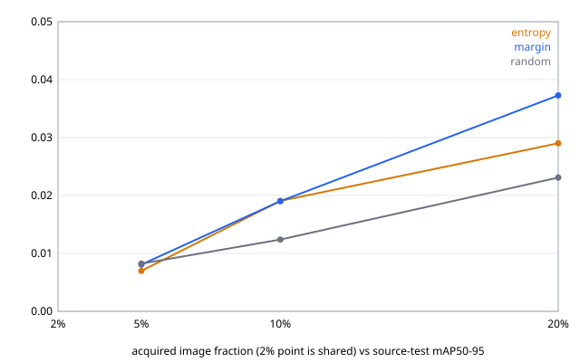

# 結果：v0.2-lite 三個 seed，RDD2022 Czech（2026-09-09）

三個登記的 seed（17、29、43）各跑完一輪完整的「基線 → 選樣 → 加入標註 → 重訓 → 同測試集比較」，共 30 個 fit，全部在同一台 RTX 4090、同一份 manifest（`3d961040…9388d`）、同一個 pinned 模型上。

| seed | 實驗 id | 時間 | 結果檔 |
|---|---|---:|---|
| 17 | `lite-czech-s17-20260909T1002Z` | 2,857 s | [目錄](lite-czech-s17-20260909T1002Z/)、[單 seed 說明](2026-09-09-lite-czech-s17.md) |
| 29 | `lite-czech-s29-20260909T1145Z` | 3,856 s | [目錄](lite-czech-s29-20260909T1145Z/) |
| 43 | `lite-czech-s43-20260909T1755Z` | 5,157 s | [目錄](lite-czech-s43-20260909T1755Z/) |

跨 seed 彙總（`val lite summarize`）在 [summary-3seeds/](summary-3seeds/)：`summary.json`、`summary.csv`、`mean-curve.svg`。

## 每個 fit 都通過的核對

30 個 fit 全部：checkpoint 位元組的 SHA-256 與 fit 收據、實驗收據三方一致；loss 前 10% 步中位數 > 後 10%；`grid_sampler_2d_backward_cuda` warning 恰 9 個；`sdpa_backend = MATH`；1,000 步；峰值 VRAM 3.39 GiB。九個 ledger 各 405 筆、每輪 67／113／225 筆、`item_id` 不重複；random 無分數，entropy 與 margin 全有分數。

## 主要數字

配對 nAUBC 差（arm 減 random，同 seed 內比較）：

| arm | seed 17 | seed 29 | seed 43 | 平均 | 中位數 | 正號 |
|---|---:|---:|---:|---:|---:|:---:|
| entropy | +0.00372 | +0.00470 | +0.00401 | +0.00415 | +0.00401 | **3/3** |
| margin | +0.00545 | +0.00577 | +0.00880 | +0.00667 | +0.00577 | **3/3** |

各預算的平均 source-test mAP50–95：

| arm | 2%（共享） | 5% | 10% | 20% |
|---|---:|---:|---:|---:|
| random | 0.0037 | 0.0082 | 0.0124 | 0.0231 |
| entropy | 0.0037 | 0.0070 | 0.0191 | 0.0290 |
| margin | 0.0037 | 0.0081 | 0.0190 | 0.0373 |

20% 時的最低類別 recall，三個 seed 都是 margin > entropy > random，且區間不重疊：

| arm | seed 17 | seed 29 | seed 43 |
|---|---:|---:|---:|
| random | 0.115 | 0.100 | 0.056 |
| entropy | 0.239 | 0.189 | 0.222 |
| margin | 0.300 | 0.241 | 0.263 |

## 能說什麼

1. **登記的正負號一致條件已滿足。** 協定要求「每個 seed 的配對 nAUBC 差都為正」才能說某個 arm 一致優於 random。entropy 與 margin 都是 3/3。
2. **20% 預算的分離最清楚。** 平均 mAP：margin 是 random 的 1.61 倍、entropy 的 1.26 倍；三個 seed 個別看，margin 與 entropy 都高於同 seed 的 random。
3. **稀有類別的差距最大也最穩。** 20% 時最低類別 recall，margin 是 random 的 2.6 到 4.7 倍，三個 arm 的區間跨 seed 完全不重疊。這比 mAP 的差距更難用執行雜訊解釋。

## 不能說什麼，以及為什麼

1. **不要只用 nAUBC 撐這個結論。** 同一個 46 張共享起點、同一 recipe，獨立跑的基線與實驗內的共享 fit 之間，mAP 差距是 seed 17 的 0.0051、seed 29 的 0.0002、seed 43 的 0.0011（來源是 CUDA `grid_sample` backward 的 atomicAdd 累加順序，v0.1 §5.2.15 已歸因）。單點最大 0.0051 與 entropy 的平均 nAUBC 差 0.0042 同量級。nAUBC 是四個點的積分且採配對設計，不能直接與單點離散度相比，但量級相近這件事必須一起講。真正撐得住的是第 2、3 點。
2. **5% 預算時不確定性選樣沒有優勢。** 平均 mAP：random 0.0082、margin 0.0081、entropy 0.0070。這是不確定性選樣典型的冷啟動行為——模型太弱時，它的不確定度排序沒有資訊量。優勢從 10% 才出現。
3. **絕對 mAP 仍然很低（≤ 0.04）。** 1,000 步、最多 451 張、62% 負樣本、未調 LR。相對比較成立，但這不是可用的偵測器，不要把這條曲線當成 RDD 的效能報告。
4. **不使用「降低標註成本」這個說法。** v0.1 §2.3 對這句話列了五個條件（含 §10.4 的目標成本審查表、類別 recall 條件、China Drone 分開報告等），v0.2-lite 沒有涵蓋。目前可說的上限是「在此設定下，兩個不確定性 arm 的預算曲線在三個 seed 中都高於 random」。
5. **固定步數混淆了預算與 epoch 數。** 46 張跑 1,000 步約 170 個 epoch，451 張約 18 個。已列為協定的已知限制，v0.2.1 的候選修法是固定 epoch 數加最低步數。

## 可重現性宣稱（依協定 §7）

在 Windows 11、RTX 4090（driver 591.86）、torch 2.12.0+cu126、transformers 5.15.0 上以固定 seed 執行；每個 fit 有收據綁定 manifest、模型與 checkpoint 雜湊。同機同 seed 的重播離散度：單步層級由 66 對副本量化（模型更新 relative L2 最大 6.4e-2），fit 層級由上述三對基線對照具體呈現（最大 0.0051 mAP）。不宣稱 deterministic、bitwise reproducible、跨機器可重現，或人工標註成本節省。

## 下一步

- v0.2.1：把訓練長度改為固定 epoch 數加最低步數，重跑三個 seed，確認 arm 排序在兩種長度規則下是否相同。這是目前最大的方法論疑慮。
- 若要再提升結論強度：加入 core-set 與 hybrid（需要 DINOv2 embedding），或把預算延伸到 40%。兩者都屬新的協定版本。
