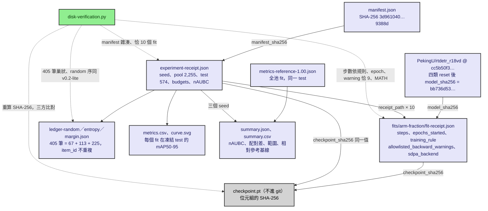
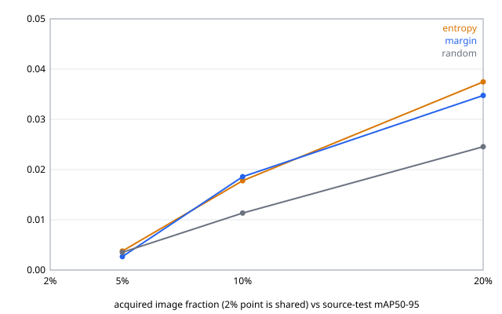

# 結果：v0.2.1 訓練長度規則驗證與全標籤參考基線，RDD2022 Czech（2026-09-11）

依 [v0.2.1 預先登記協定](../protocols/2026-09-10-v0.2.1-training-rule.md) 執行：規則 B（`fixed-epochs`，每個 fit `max(200, 18 × floor(N/8))` 步）的三個 seed 完整實驗、規則 B 與規則 A 各三個全標籤參考基線。規則 A（`fixed-steps`，1,000 步）的三 seed 實驗沿用 [v0.2-lite 的結果](2026-09-09-lite-czech-three-seeds.md)，不重跑。協定 §1–§3 在看到結果前後都沒有改動。

所有 GPU 執行在同一台 RTX 4090、同一份 manifest（`3d961040…9388d`）、同一個 pinned 模型上，由 `scripts/run_lite_seed17.ps1` 依序啟動，一次一條。

## 1. 執行清單

| 執行 | 實驗 id | 啟動（UTC） | 牆鐘時間 | 退出碼 |
|---|---|---|---:|---:|
| 規則 B seed 17（2% 基線＋參考＋10 fit） | [`lite-czech-ep18-s17-20260911T0546Z`](lite-czech-ep18-s17-20260911T0546Z/) | 05:46Z | 78 分 | 0 |
| 規則 B seed 29 | [`lite-czech-ep18-s29-20260911T0707Z`](lite-czech-ep18-s29-20260911T0707Z/) | 07:07Z | 53 分 | 0 |
| 規則 B seed 43 | [`lite-czech-ep18-s43-20260911T0801Z`](lite-czech-ep18-s43-20260911T0801Z/) | 08:01Z | 44 分 | 0 |
| 規則 B 參考基線 seed 17 | [`lite-czech-ref-fixed-epochs-s17-20260911T0546Z`](lite-czech-ref-fixed-epochs-s17-20260911T0546Z/) | 同上列 | fit 1774 s | 0 |
| 規則 B 參考基線 seed 29 | [`lite-czech-ref-fixed-epochs-s29-20260911T0707Z`](lite-czech-ref-fixed-epochs-s29-20260911T0707Z/) | 同上列 | fit 1521 s | 0 |
| 規則 B 參考基線 seed 43 | [`lite-czech-ref-fixed-epochs-s43-20260911T0801Z`](lite-czech-ref-fixed-epochs-s43-20260911T0801Z/) | 同上列 | fit 1060 s | 0 |
| 規則 A 參考基線 seed 17 | [`lite-czech-ref-fixed-steps-s17-20260911T0846Z`](lite-czech-ref-fixed-steps-s17-20260911T0846Z/) | 08:46Z | fit 214 s | 0 |
| 規則 A 參考基線 seed 29 | [`lite-czech-ref-fixed-steps-s29-20260911T0853Z`](lite-czech-ref-fixed-steps-s29-20260911T0853Z/) | 08:53Z | fit 210 s | 0 |
| 規則 A 參考基線 seed 43 | [`lite-czech-ref-fixed-steps-s43-20260911T0858Z`](lite-czech-ref-fixed-steps-s43-20260911T0858Z/) | 08:58Z | fit 214 s | 0 |

跨 seed 彙總（`val lite summarize`）：規則 B 在 [summary-ep18-3seeds/](summary-ep18-3seeds/)；規則 A 加參考基線在 [summary-3seeds-with-reference/](summary-3seeds-with-reference/)。原 [summary-3seeds/](summary-3seeds/) 未動。每個實驗目錄放 `metrics.csv`、`curve.svg`、三個 ledger、實驗收據與獨立跑的 2% 基線 metrics；參考基線目錄放 `metrics-reference-1.00.json` 與 fit 收據。checkpoint、影像、標註與逐字紀錄留在私有證據根目錄。

## 2. 從磁碟核對過的事

證據檔之間靠哪些欄位互相綁定（實線），以及核對腳本重算並比對哪些連線（虛線）：

每個規則 B 實驗（共 30 個 fit）與六個參考基線都用同一支核對腳本（[2026-09-11-v0.2.1-disk-verification.py](../verification/2026-09-11-v0.2.1-disk-verification.py)，輸出 [.json](../verification/2026-09-11-v0.2.1-disk-verification.json)）檢查：

- 步數依規則：規則 B 的 fit 依影像數為 200／252／504／1,008，參考基線 5,058；規則 A 參考基線 1,000。`epochs_started` 在 5% 以上都是 18；2% 是 **40**（46 張每 epoch 只湊得出 5 個整批，200 ÷ 5），協定表格寫的「約 35」是用 46 ÷ 8 = 5.75 估的，實際以收據為準。
- 每個 fit 恰 9 個 `grid_sampler_2d_backward_cuda` allowlist warning、`sdpa_backend = MATH`、loss 前 10% 步中位數高於後 10%。
- 每個 fit 的 `model_sha256` 與 v0.2-lite 的 40 個收據相同（`bb736d53…`）；checkpoint 位元組的 SHA-256 與 fit 收據、實驗收據三方一致；manifest 雜湊相同。
- 九個 ledger 各 405 筆、每輪 67／113／225 筆、`item_id` 不重複。random 的序與 v0.2-lite 同 seed 完全相同（凍結序有效）；entropy 與 margin 的選圖與 v0.2-lite 不同，因為 2% 起點模型從 1,000 步改為 200 步（seed 17 重疊 230／405 與 166／405）。
- 六個 transcript log 都沒有 Traceback；鎖檔已移除；沒有 `failure.json`。

## 3. 絕對表現：mAP50–95（凍結 test，574 張）

### 規則 B `fixed-epochs`（本輪）

| arm | seed | 2%（共享） | 5% | 10% | 20% | nAUBC | Δ 對 random |
|---|---:|---:|---:|---:|---:|---:|---:|
| random | 17 | 0.0052 | 0.0043 | 0.0154 | 0.0292 | 0.01591 | — |
| random | 29 | 0.0006 | 0.0054 | 0.0092 | 0.0203 | 0.01070 | — |
| random | 43 | 0.0009 | 0.0009 | 0.0095 | 0.0242 | 0.01093 | — |
| entropy | 17 | 0.0052 | 0.0030 | 0.0189 | 0.0412 | 0.02043 | +0.00452 |
| entropy | 29 | 0.0006 | 0.0025 | 0.0117 | 0.0356 | 0.01537 | +0.00467 |
| entropy | 43 | 0.0009 | 0.0059 | 0.0227 | 0.0356 | 0.02073 | +0.00979 |
| margin | 17 | 0.0052 | 0.0032 | 0.0187 | 0.0320 | 0.01785 | +0.00194 |
| margin | 29 | 0.0006 | 0.0015 | 0.0172 | 0.0343 | 0.01707 | +0.00637 |
| margin | 43 | 0.0009 | 0.0032 | 0.0199 | 0.0380 | 0.01961 | +0.00868 |

### 規則 A `fixed-steps`（v0.2-lite，沿用）

| arm | seed | 2%（共享） | 5% | 10% | 20% | nAUBC | Δ 對 random |
|---|---:|---:|---:|---:|---:|---:|---:|
| random | 17 | 0.0021 | 0.0123 | 0.0113 | 0.0256 | 0.01472 | — |
| random | 29 | 0.0025 | 0.0102 | 0.0147 | 0.0215 | 0.01458 | — |
| random | 43 | 0.0065 | 0.0022 | 0.0111 | 0.0222 | 0.01184 | — |
| entropy | 17 | 0.0021 | 0.0076 | 0.0189 | 0.0314 | 0.01845 | +0.00372 |
| entropy | 29 | 0.0025 | 0.0063 | 0.0229 | 0.0293 | 0.01928 | +0.00470 |
| entropy | 43 | 0.0065 | 0.0070 | 0.0154 | 0.0263 | 0.01585 | +0.00401 |
| margin | 17 | 0.0021 | 0.0068 | 0.0192 | 0.0378 | 0.02018 | +0.00545 |
| margin | 29 | 0.0025 | 0.0049 | 0.0199 | 0.0388 | 0.02035 | +0.00577 |
| margin | 43 | 0.0065 | 0.0125 | 0.0180 | 0.0352 | 0.02064 | +0.00880 |

規則 B 各預算的平均與**範圍**（三個 seed 的最小／最大，不是信賴區間）：

| arm | 5% 平均 | 10% 平均 | 20% 平均 | 20% 範圍 |
|---|---:|---:|---:|---:|
| random | 0.0035 | 0.0113 | 0.0245 | 0.0203–0.0292 |
| entropy | 0.0038 | 0.0178 | 0.0375 | 0.0356–0.0412 |
| margin | 0.0027 | 0.0186 | 0.0348 | 0.0320–0.0380 |

## 4. 主要比較量：配對 nAUBC 差（arm − random，同 seed 內）

| 規則 | arm | seed 17 | seed 29 | seed 43 | 平均 | 中位數 | 正號 |
|---|---|---:|---:|---:|---:|---:|:---:|
| fixed-epochs | entropy | +0.00452 | +0.00467 | +0.00979 | +0.00633 | +0.00467 | **3/3** |
| fixed-epochs | margin | +0.00194 | +0.00637 | +0.00868 | +0.00566 | +0.00637 | **3/3** |
| fixed-steps | entropy | +0.00372 | +0.00470 | +0.00401 | +0.00415 | +0.00401 | **3/3** |
| fixed-steps | margin | +0.00545 | +0.00577 | +0.00880 | +0.00667 | +0.00577 | **3/3** |

判定（協定 §3，寫在看結果之前）：規則 B 下 margin − random 三個 seed 都為正，entropy − random 也都為正，與規則 A 的 3/3 相同。**「margin 與 entropy 對 random 的優勢在兩種訓練長度規則下正負號一致」成立。** 量值不下結論：seed 17 的 margin 差 +0.0019 落在 audit 記錄的 seed 43 同機重播對（Δ 相差 0.002、20% mAP 相差最大 0.0079）的尺度之內。

## 5. 次要指標

### 20% 的 mAP50–95 與配對差

| 規則 | arm | seed 17 | seed 29 | seed 43 | 平均 |
|---|---|---:|---:|---:|---:|
| fixed-epochs | random | 0.0292 | 0.0203 | 0.0242 | 0.0245 |
| fixed-epochs | entropy | 0.0412 | 0.0356 | 0.0356 | 0.0375 |
| fixed-epochs | margin | 0.0320 | 0.0343 | 0.0380 | 0.0348 |
| fixed-steps | random | 0.0256 | 0.0215 | 0.0222 | 0.0231 |
| fixed-steps | entropy | 0.0314 | 0.0293 | 0.0263 | 0.0290 |
| fixed-steps | margin | 0.0378 | 0.0388 | 0.0352 | 0.0373 |

規則 B 下 20% 的配對差（arm − random）：entropy seed 17 +0.0120、seed 29 +0.0154、seed 43 +0.0114；margin seed 17 +0.0028、seed 29 +0.0140、seed 43 +0.0138。六個都為正。

### 20% 的最低類別 recall

| 規則 | arm | seed 17 | seed 29 | seed 43 |
|---|---|---:|---:|---:|
| fixed-epochs | random | 0.281 | 0.148 | 0.107 |
| fixed-epochs | entropy | 0.318 | 0.219 | 0.280 |
| fixed-epochs | margin | 0.293 | 0.230 | 0.293 |
| fixed-steps | random | 0.115 | 0.100 | 0.056 |
| fixed-steps | entropy | 0.239 | 0.189 | 0.222 |
| fixed-steps | margin | 0.300 | 0.241 | 0.263 |

規則 A 下三個 arm 的區間互不重疊（v0.2-lite 報告的第 3 點）。**規則 B 下這個分離不成立**：seed 17 的 random 0.281 與 margin 0.293 幾乎相同，random 的範圍 0.107–0.281 與 entropy 0.219–0.318、margin 0.230–0.293 重疊。規則 B 讓 random 在 20% 也訓練到 18 個 epoch 之後，稀有類別的 recall 差距縮小了；這是本輪的一個負面結果，照實列出。

### 相對參考基線的比例（20% mAP ÷ 同 seed 同規則參考基線）

| 規則 | seed | 參考基線 mAP | random | entropy | margin |
|---|---:|---:|---:|---:|---:|
| fixed-epochs | 17 | 0.0656 | 0.445 | 0.628 | 0.489 |
| fixed-epochs | 29 | 0.0670 | 0.302 | 0.532 | 0.512 |
| fixed-epochs | 43 | 0.0666 | 0.363 | 0.534 | 0.570 |
| fixed-steps | 17 | 0.0368 | 0.694 | 0.853 | 1.028 |
| fixed-steps | 29 | 0.0347 | 0.620 | 0.845 | 1.118 |
| fixed-steps | 43 | 0.0425 | 0.522 | 0.620 | 0.830 |

## 6. 全標籤參考基線

| 規則 | seed | 步數 | epoch | mAP50–95 | AP50 | 最低類別 recall | fit 秒數 | 末段 loss 中位數 |
|---|---:|---:|---:|---:|---:|---:|---:|---:|
| fixed-epochs | 17 | 5,058 | 18 | 0.0656 | 0.2052 | 0.252 | 1774 | 8.66 |
| fixed-epochs | 29 | 5,058 | 18 | 0.0670 | 0.1972 | 0.332 | 1521 | 8.82 |
| fixed-epochs | 43 | 5,058 | 18 | 0.0666 | 0.2121 | 0.326 | 1060 | 8.70 |
| fixed-steps | 17 | 1,000 | 4 | 0.0368 | 0.0960 | 0.289 | 214 | 12.96 |
| fixed-steps | 29 | 1,000 | 4 | 0.0347 | 0.1000 | 0.259 | 210 | 12.95 |
| fixed-steps | 43 | 1,000 | 4 | 0.0425 | 0.1197 | 0.285 | 214 | 13.06 |

規則 B 的參考基線（2,255 張、18 epoch、5,058 步）三個 seed 的 mAP50–95 範圍是 0.0656–0.0670，是本 recipe 在此資料量的上限參照；20% 預算的最佳 arm 約達它的一半到六成。規則 A 的參考基線（同樣 2,255 張，但只有 1,000 步，收據 `epochs_started` = 4，即 3.5 個完整 epoch）範圍是 0.0347–0.0425，與同規則下 20% margin arm 的 0.0352–0.0388 重疊。這是規則 A 的性質：固定 1,000 步對全量資料是欠訓的。它只能說明「固定 GPU 成本下，全部標籤並不比 20% 的標籤多換到 mAP」，不能拿來說參考基線合理，也不能反過來說 20% 的資料已經足夠——後者要在規則 B 下看，而規則 B 下 20% 只到參考基線的 0.30–0.63。

## 7. 每個設定實際揭露的資料量（影像／框／負樣本）

2% 共享起點與 random 的序在兩種規則下相同，所以這些列的數字與 v0.2-lite 一致；entropy 與 margin 的選圖不同。規則 B：

| 設定 | seed 17 | seed 29 | seed 43 |
|---|---|---|---|
| shared-0.02 | 46 / 29 / 31 | 46 / 22 / 32 | 46 / 24 / 30 |
| random-0.05 | 113 / 82 / 64 | 113 / 71 / 72 | 113 / 66 / 77 |
| random-0.10 | 226 / 160 / 132 | 226 / 127 / 143 | 226 / 130 / 149 |
| random-0.20 | 451 / 319 / 265 | 451 / 277 / 280 | 451 / 268 / 280 |
| entropy-0.05 | 113 / 77 / 67 | 113 / 91 / 63 | 113 / 91 / 59 |
| entropy-0.10 | 226 / 260 / 103 | 226 / 258 / 112 | 226 / 294 / 89 |
| entropy-0.20 | 451 / 565 / 191 | 451 / 507 / 210 | 451 / 553 / 186 |
| margin-0.05 | 113 / 73 / 67 | 113 / 86 / 67 | 113 / 82 / 63 |
| margin-0.10 | 226 / 245 / 106 | 226 / 241 / 119 | 226 / 247 / 101 |
| margin-0.20 | 451 / 574 / 186 | 451 / 556 / 191 | 451 / 536 / 194 |

規則 A（v0.2-lite）同表：

| 設定 | seed 17 | seed 29 | seed 43 |
|---|---|---|---|
| shared-0.02 | 46 / 29 / 31 | 46 / 22 / 32 | 46 / 24 / 30 |
| random-0.05 | 113 / 82 / 64 | 113 / 71 / 72 | 113 / 66 / 77 |
| random-0.10 | 226 / 160 / 132 | 226 / 127 / 143 | 226 / 130 / 149 |
| random-0.20 | 451 / 319 / 265 | 451 / 277 / 280 | 451 / 268 / 280 |
| entropy-0.05 | 113 / 93 / 63 | 113 / 92 / 65 | 113 / 71 / 67 |
| entropy-0.10 | 226 / 208 / 117 | 226 / 234 / 116 | 226 / 229 / 108 |
| entropy-0.20 | 451 / 566 / 177 | 451 / 492 / 219 | 451 / 487 / 218 |
| margin-0.05 | 113 / 102 / 59 | 113 / 94 / 65 | 113 / 94 / 60 |
| margin-0.10 | 226 / 265 / 99 | 226 / 262 / 106 | 226 / 258 / 98 |
| margin-0.20 | 451 / 470 / 219 | 451 / 595 / 175 | 451 / 610 / 163 |

20% 時兩個不確定性 arm 在同樣的 451 張下揭露的框數是 random 的 1.8 到 2.1 倍（random 268–319 框，entropy 507–565，margin 536–574），負樣本約 0.7 倍（random 265–280 張，entropy 186–210，margin 186–194）。這是「同影像預算下框更多」，不是「同框預算下影像更少」；標註時間沒有量測。

## 8. 步數、epoch 與秒數

規則 B 每個 fit（秒數是 fit 本身，不含載入、打分與評估）：

| fit | 步數 | epoch | seed 17 | seed 29 | seed 43 |
|---|---:|---:|---:|---:|---:|
| shared-0.02 | 200 | 40 | 94 | 45 | 41 |
| random-0.05 | 252 | 18 | 123 | 57 | 53 |
| random-0.10 | 504 | 18 | 241 | 112 | 108 |
| random-0.20 | 1,008 | 18 | 483 | 224 | 208 |
| entropy-0.05 | 252 | 18 | 122 | 56 | 55 |
| entropy-0.10 | 504 | 18 | 215 | 112 | 108 |
| entropy-0.20 | 1,008 | 18 | 476 | 228 | 213 |
| margin-0.05 | 252 | 18 | 115 | 57 | 55 |
| margin-0.10 | 504 | 18 | 233 | 114 | 105 |
| margin-0.20 | 1,008 | 18 | 291 | 226 | 213 |

實驗收據的階段秒數：
- seed 17：fit 2391 s、全池打分 190 s、test 評估 121 s
- seed 29：fit 1229 s、全池打分 122 s、test 評估 117 s
- seed 43：fit 1159 s、全池打分 115 s、test 評估 111 s

1,008 步的 fit 每步秒數：seed 17 為 0.29–0.48 s，seed 29 與 43 為 0.21–0.22 s；seed 17 執行期間桌面上另有 Docker Desktop 與瀏覽器在用 GPU，秒數不可跨 seed 比較。規則 B 三個 seed 的 GPU 牆鐘時間合計 2 小時 55 分；規則 A 參考基線每個 fit 約 4 分。

## 9. 規則 A 與規則 B 並列

| 項目 | 規則 A `fixed-steps` | 規則 B `fixed-epochs` |
|---|---|---|
| 每 fit 步數 | 1,000 | 200／252／504／1,008（2%／5%／10%／20%） |
| 2% 的 epoch | 約 200 | 40 |
| 20% 的 epoch | 約 18 | 18 |
| Δ entropy 正號 | 3/3 | 3/3 |
| Δ margin 正號 | 3/3 | 3/3 |
| 20% 平均 mAP random／entropy／margin | 0.0231／0.0290／0.0373 | 0.0245／0.0375／0.0348 |
| 20% 最低類別 recall 區間分離 | 成立（三 arm 不重疊） | 不成立（random 與兩個 arm 重疊） |
| 5% 預算 | 不確定性 arm 無優勢 | 同樣無優勢（平均 random 0.0035、entropy 0.0038、margin 0.0027） |
| 參考基線 mAP（三 seed 範圍） | 0.0347–0.0425（1,000 步，欠訓） | 0.0656–0.0670 |
| 20% 佔參考基線（三 seed 範圍）random／entropy／margin | 0.52–0.69／0.62–0.85／0.83–1.12 | 0.30–0.45／0.53–0.63／0.49–0.57 |

兩種規則回答不同的問題（協定 §1），不預設哪一個公平。規則 B 把小預算端的訓練量壓低（2% 從 200 個 epoch 降到 40，5% 從約 71 降到 18；audit 表用 1,000 × 8 ÷ 張數估的 174 沒有考慮每 epoch 只取整批）。三個 arm 的 5% 平均都下降（random 0.0082→0.0035）；10% 與 20% 的 random 幾乎不變（0.0124→0.0113、0.0231→0.0245）；20% 的 entropy 上升（0.0290→0.0375）、margin 略降（0.0373→0.0348）。排序「兩個不確定性 arm > random」在兩種規則下相同，但 margin 對 entropy 的相對位置換了（規則 A 下 margin 平均高於 entropy，規則 B 下 entropy 平均高於 margin），這個差距在重播尺度內，不下結論。

## 10. 還不能宣稱什麼

1. **不宣稱降低人工標註成本。** 沒有量測標註時間；§7 只顯示同影像數下框數更多，這可能意味著每張標註更花時間。
2. **不宣稱 deterministic 或跨機可重現。** 同機同 seed 的重播都不是位元相同（audit 文件）；本輪的 2% 共享 fit 在實驗內重新訓練一次，與獨立跑的 2% 基線 mAP 不同（seed 17：0.0052 對 0.0023），與 v0.2-lite 的現象相同。
3. **三個 seed 的最大／最小只是範圍**，不是信賴區間；n = 3 不做區間估計，也不對 Δ 的量值設門檻。
4. **量值仍在重播尺度內。** seed 17 的 margin Δ +0.0019 比 seed 43 兩次重播的 Δ 差（0.002）還小；撐得住的是正負號 3/3 與 20% 六個配對差全為正，不是任何一個平均值。
5. **最低類別 recall 的區間分離在規則 B 下消失。** v0.2-lite 報告把它列為最難用雜訊解釋的證據；本輪顯示它與訓練長度規則有關，不能再單獨當作結論。
6. **5% 預算仍無優勢**（冷啟動），兩種規則一致。
7. **絕對 mAP 很低。** 20% 最高 0.041，全標籤參考基線 0.066；這是本 recipe（RT-DETR r18、batch 8、未調 LR、62% 負樣本）在此資料量的上限參照，不是 RDD 文獻的 SOTA，也不與任何外部數字比較。規則 A 的參考基線只有 1,000 步，是欠訓的固定成本上限，不能拿來說參考基線「合理」。
8. **秒數不可比。** seed 17 期間 GPU 與桌面程式共用；報告計算成本時以 seed 29、43 為準並註明。
9. 第一輪沒有 core-set、hybrid 或其他新演算法；沒有調任何超參數；test 沒有用來做任何選擇。

## 11. 可重現性宣稱（沿用 v0.2-lite 協定 §7 的措辭）

在 Windows 11、RTX 4090（driver 591.86）、torch 2.12.0+cu126、transformers 5.15.0 上以固定 seed 執行；每個 fit 有收據綁定 manifest、模型與 checkpoint 雜湊，實驗收據記錄各階段秒數。不宣稱 deterministic、bitwise reproducible、跨機器可重現，或人工標註成本節省。

## 12. 下一步

- 若要再提升結論強度：core-set 與 hybrid（需要 DINOv2 embedding）、40% 預算，或第二個國別子集。都屬新的協定版本。
- 若要處理「最低類別 recall 在規則 B 下不分離」：需要先把類別層級的重播離散度量出來，再決定它是不是可報告的指標。
