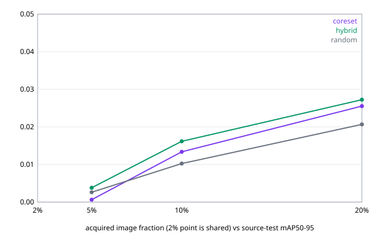

# 結果：v0.3 core-set 與 hybrid 選樣，RDD2022 Czech（2026-09-12）

依 [v0.3 預先登記協定](../superpowers/specs/2026-09-11-val-v0.3-diversity-protocol.md) 執行：規則 B（`fixed-epochs`）下三個 seed 各跑一次 `random + coreset + hybrid` 的實驗（10 個 fit），與 v0.2.1 的 entropy／margin 並列。協定 §1–§3 在看到結果前後都沒有改動。

所有 GPU 執行在同一台 RTX 4090、同一份 manifest（`3d961040…9388d`）、同一個 pinned RT-DETR 模型上，由 `scripts/run_lite_seed17.ps1 -Arms random,coreset,hybrid -Embeddings …` 依序啟動，一次一條。core-set 與 hybrid 的向量來自 pinned DINOv2-small（`ed25f3a3…`），對 pool 全部 2,255 張算一次、存檔後所有選樣只讀檔。

## 1. 執行清單

| 執行 | 實驗 id | 基線啟動（UTC） | 結束（UTC） | 等 GPU 取樣次數 | 退出碼 |
|---|---|---|---|---:|---:|
| seed 17 | [`lite-czech-ep18-div-s17-20260911T1411Z`](lite-czech-ep18-div-s17-20260911T1411Z/) | 14:12:42Z | 15:06:41Z | 2 | 0 |
| seed 29 | [`lite-czech-ep18-div-s29-20260911T1541Z`](lite-czech-ep18-div-s29-20260911T1541Z/) | 16:13:47Z | 17:10:34Z | 64 | 0 |
| seed 43 | [`lite-czech-ep18-div-s43-20260911T1712Z`](lite-czech-ep18-div-s43-20260911T1712Z/) | 17:16:58Z | 18:08:45Z | 8 | 0 |

embedding 檔 `embeddings-dinov2-small.npz`：2255 張 × 384 維，SHA-256 `53ff05766e7345e4…`，收據綁定 manifest 雜湊與快照三個檔的雜湊（`config.json` `1809f83e…`、`model.safetensors` `ae1e99fc…`、`preprocessor_config.json` `14e780d8…`），在 CPU 上計算。三份實驗收據的 `embeddings_sha256` 與它相同。

跨 seed 彙總在 [summary-ep18-div-3seeds/](summary-ep18-div-3seeds/)（附 v0.2.1 規則 B 的三個參考基線）。每個實驗目錄放 `metrics.csv`、`curve.svg`、三個 ledger、`hybrid-shortlists.json`、實驗收據與獨立跑的 2% 基線 metrics；checkpoint、影像、npz 與逐字紀錄留在私有證據根目錄。

執行期間這台機器另有其他專案的 GPU 工作：seed 17 的實驗與另一個工作重疊（fit 秒數見 §7），seed 29、43 的啟動器分別等了 GPU 才開始；秒數不能跨 seed 比較，也不能與 v0.2.1 比較。

## 2. 從磁碟核對過的事

核對腳本 [2026-09-11-v0.3-disk-verification.py](../status/2026-09-11-v0.3-disk-verification.py)（輸出 [.json](../status/2026-09-11-v0.3-disk-verification.json)）對三個實驗檢查，全部通過：

- 與 v0.2.1 相同的項目：每個 fit 步數依規則 B 為 200／252／504／1,008、`epochs_started` 40／18／18／18、恰 9 個 allowlist warning、`sdpa_backend = MATH`、`model_sha256` 等於 v0.2-lite 的 `bb736d53…`、checkpoint 位元組的 SHA-256 與 fit 收據和實驗收據三方一致、manifest 雜湊相同、九個 ledger 各 405 筆巢狀不重複、random 的序與 v0.2.1 同 seed 完全相同、log 無 Traceback、鎖檔已移除。
- **選圖重算**：從 npz 與已標註集合重跑貪婪 k-center，core-set 三輪 405 筆的 `item_id` 序列與 ledger 逐字相同、每筆距離一致；hybrid 從存檔的候選清單（每輪 `min(5b, 剩餘)` 筆，依 entropy 分數與 `item_id` 排序）重跑 k-center，同樣逐字相同。三個 seed 都是。
- embedding 檔的 SHA-256 與它的收據、三份實驗收據一致；收據綁定的 manifest 雜湊與 pool 張數相符。

## 3. 絕對表現：mAP50–95（凍結 test，574 張）

| arm | seed | 2%（共享） | 5% | 10% | 20% | nAUBC | Δ 對 random |
|---|---:|---:|---:|---:|---:|---:|---:|
| random | 17 | 0.0016 | 0.0031 | 0.0141 | 0.0282 | 0.01453 | — |
| random | 29 | 0.0005 | 0.0029 | 0.0108 | 0.0171 | 0.00996 | — |
| random | 43 | 0.0011 | 0.0019 | 0.0058 | 0.0167 | 0.00757 | — |
| coreset | 17 | 0.0016 | 0.0004 | 0.0152 | 0.0263 | 0.01385 | -0.00068 |
| coreset | 29 | 0.0005 | 0.0006 | 0.0147 | 0.0252 | 0.01327 | +0.00331 |
| coreset | 43 | 0.0011 | 0.0010 | 0.0103 | 0.0251 | 0.01156 | +0.00399 |
| hybrid | 17 | 0.0016 | 0.0071 | 0.0136 | 0.0334 | 0.01666 | +0.00213 |
| hybrid | 29 | 0.0005 | 0.0031 | 0.0121 | 0.0250 | 0.01274 | +0.00278 |
| hybrid | 43 | 0.0011 | 0.0012 | 0.0228 | 0.0233 | 0.01632 | +0.00875 |

各預算的平均與**範圍**（三個 seed 的最小／最大，不是信賴區間）：

| arm | 5% 平均 | 10% 平均 | 20% 平均 | 20% 範圍 |
|---|---:|---:|---:|---:|
| random | 0.0026 | 0.0103 | 0.0207 | 0.0167–0.0282 |
| coreset | 0.0006 | 0.0134 | 0.0255 | 0.0251–0.0263 |
| hybrid | 0.0038 | 0.0162 | 0.0272 | 0.0233–0.0334 |

## 4. 主要比較量：配對 nAUBC 差（arm − random，同一次實驗內）

| arm | seed 17 | seed 29 | seed 43 | 平均 | 中位數 | 正號 |
|---|---:|---:|---:|---:|---:|:---:|
| coreset | -0.00068 | +0.00331 | +0.00399 | +0.00221 | +0.00331 | **2/3** |
| hybrid | +0.00213 | +0.00278 | +0.00875 | +0.00455 | +0.00278 | **3/3** |

判定（協定 §3，寫在看結果之前）：
- **hybrid − random 三個 seed 都為正（3/3）**：「hybrid 一致優於 random」成立。量值不下結論：seed 17 的 +0.0021 落在同機重播尺度內（§8）。
- **core-set − random 在 seed 17 為負（-0.0007），另兩個 seed 為正**：依協定寫「**core-set 在規則 B 下不一致**」，不用平均值（+0.0022）救回。

## 5. 次要指標

### 20% 的 mAP50–95 與配對差

| arm | seed 17 | seed 29 | seed 43 | 平均 |
|---|---:|---:|---:|---:|
| random | 0.0282 | 0.0171 | 0.0167 | 0.0207 |
| coreset | 0.0263 | 0.0252 | 0.0251 | 0.0255 |
| hybrid | 0.0334 | 0.0250 | 0.0233 | 0.0272 |

20% 的配對差（arm − random）：core-set seed 17 -0.0019、seed 29 +0.0080、seed 43 +0.0084；hybrid seed 17 +0.0052、seed 29 +0.0079、seed 43 +0.0066。core-set 2/3 為正，hybrid 3/3 為正。

### 20% 的最低類別 recall（只報範圍）

| arm | seed 17 | seed 29 | seed 43 | 範圍 |
|---|---:|---:|---:|---:|
| random | 0.170 | 0.133 | 0.074 | 0.074–0.170 |
| coreset | 0.137 | 0.144 | 0.041 | 0.041–0.144 |
| hybrid | 0.196 | 0.078 | 0.074 | 0.074–0.196 |

三個 arm 的範圍互相重疊；依協定本輪不用最低類別 recall 下任何結論。

### 相對參考基線的比例（20% mAP ÷ 同 seed 規則 B 參考基線）

| seed | 參考基線 mAP | random | coreset | hybrid |
|---:|---:|---:|---:|---:|
| 17 | 0.0656 | 0.430 | 0.401 | 0.509 |
| 29 | 0.0670 | 0.256 | 0.376 | 0.374 |
| 43 | 0.0666 | 0.250 | 0.377 | 0.350 |

範圍：random 0.25–0.43、core-set 0.38–0.40、hybrid 0.35–0.51。

## 6. 每個設定實際揭露的資料量（影像／框／負樣本）

| 設定 | seed 17 | seed 29 | seed 43 |
|---|---|---|---|
| shared-0.02 | 46 / 29 / 31 | 46 / 22 / 32 | 46 / 24 / 30 |
| random-0.05 | 113 / 82 / 64 | 113 / 71 / 72 | 113 / 66 / 77 |
| random-0.10 | 226 / 160 / 132 | 226 / 127 / 143 | 226 / 130 / 149 |
| random-0.20 | 451 / 319 / 265 | 451 / 277 / 280 | 451 / 268 / 280 |
| coreset-0.05 | 113 / 64 / 75 | 113 / 54 / 77 | 113 / 50 / 78 |
| coreset-0.10 | 226 / 131 / 144 | 226 / 105 / 154 | 226 / 122 / 142 |
| coreset-0.20 | 451 / 258 / 287 | 451 / 239 / 296 | 451 / 250 / 276 |
| hybrid-0.05 | 113 / 77 / 72 | 113 / 74 / 71 | 113 / 57 / 73 |
| hybrid-0.10 | 226 / 168 / 131 | 226 / 178 / 120 | 226 / 127 / 145 |
| hybrid-0.20 | 451 / 315 / 257 | 451 / 350 / 244 | 451 / 290 / 266 |

20% 時，core-set 揭露的負樣本（276–296 張）不少於 random（265–280），框數（239–258）少於 random（268–319）：k-center 覆蓋整個影像分布，而 pool 有 62% 負樣本，這是協定預告的性質，照實列出。hybrid 因為先用 entropy 篩候選，框數（290–350）高於 random、負樣本（244–266）低於 random。標註時間沒有量測。

## 7. 步數、epoch 與秒數

| fit | 步數 | epoch | seed 17 | seed 29 | seed 43 |
|---|---:|---:|---:|---:|---:|
| shared-0.02 | 200 | 40 | 91 | 93 | 90 |
| random-0.05 | 252 | 18 | 121 | 116 | 108 |
| random-0.10 | 504 | 18 | 239 | 237 | 224 |
| random-0.20 | 1,008 | 18 | 499 | 515 | 471 |
| coreset-0.05 | 252 | 18 | 132 | 144 | 119 |
| coreset-0.10 | 504 | 18 | 249 | 283 | 241 |
| coreset-0.20 | 1,008 | 18 | 495 | 565 | 473 |
| hybrid-0.05 | 252 | 18 | 108 | 138 | 121 |
| hybrid-0.10 | 504 | 18 | 217 | 272 | 232 |
| hybrid-0.20 | 1,008 | 18 | 447 | 468 | 487 |

實驗收據的階段秒數：
- seed 17：fit 2598 s、打分 126 s（只有 hybrid 打分）、test 評估 230 s
- seed 29：fit 2830 s、打分 133 s（只有 hybrid 打分）、test 評估 233 s
- seed 43：fit 2565 s、打分 96 s（只有 hybrid 打分）、test 評估 227 s

k-center 本身在 CPU 上每輪數秒，不計入打分秒數。三個 seed 的 fit 都比 v0.2.1 不共用 GPU 時（1,159 到 1,229 s）慢一倍以上，因為同時段有其他專案在用 GPU；秒數不可比。

## 8. 與 v0.2.1 entropy／margin 的並列（不同實驗、不同 2% fit，不配對）

| 量 | random（v0.2.1） | random（v0.3） | entropy（v0.2.1） | margin（v0.2.1） | core-set（v0.3） | hybrid（v0.3） |
|---|---:|---:|---:|---:|---:|---:|
| 20% mAP 範圍 | 0.0203–0.0292 | 0.0167–0.0282 | 0.0356–0.0412 | 0.0320–0.0380 | 0.0251–0.0263 | 0.0233–0.0334 |
| Δ nAUBC 對 random（每 seed） | — | — | +0.0045／+0.0047／+0.0098 | +0.0019／+0.0064／+0.0087 | -0.0007／+0.0033／+0.0040 | +0.0021／+0.0028／+0.0088 |
| 正號 | — | — | 3/3 | 3/3 | 2/3 | 3/3 |

**random arm 的同機重播對（同 seed、同一批影像、同 recipe，v0.2.1 與 v0.3 各跑一次）**：這是本輪順便得到的 12 對重播，量值尺度比 audit 裡 seed 43 的一對更完整：

| 設定 | seed 17 | seed 29 | seed 43 |
|---|---:|---:|---:|
| shared-0.02 | 0.0052 → 0.0016（-0.0036） | 0.0006 → 0.0005（-0.0002） | 0.0009 → 0.0011（+0.0002） |
| random-0.05 | 0.0043 → 0.0031（-0.0012） | 0.0054 → 0.0029（-0.0025） | 0.0009 → 0.0019（+0.0010） |
| random-0.10 | 0.0154 → 0.0141（-0.0013） | 0.0092 → 0.0108（+0.0017） | 0.0095 → 0.0058（-0.0036） |
| random-0.20 | 0.0292 → 0.0282（-0.0010） | 0.0203 → 0.0171（-0.0031） | 0.0242 → 0.0167（-0.0075） |

12 對的差絕對值最大 0.0075（seed 43 的 20%），與 audit 記錄的 0.0079 同量級；三個 seed 的 20% 重播都是第二次較低，但 5%／10% 正負都有，n 太小不解讀方向。這個尺度是讀 §4 量值時的參照：hybrid 的三個配對差（0.0021–0.0088）與 core-set 的（-0.0007–0.0040）都落在或接近它。

## 9. 還不能宣稱什麼

1. **core-set 對 random 不一致**：2/3 為正，協定判定為「不一致」，不寫成「略優」。
2. **hybrid 的 3/3 只是正負號一致**；量值在重播尺度內。它與 v0.2.1 的 entropy／margin 不能配對比較（不同實驗、不同 2% fit）；三者的 20% 範圍互相重疊。
3. **不宣稱降低人工標註成本**；§6 顯示三個 arm 揭露的框數與負樣本數各不相同，標註時間沒有量測。
4. **不宣稱 deterministic 或跨機可重現**：embedding 前向不保證位元相同；選樣以存檔的 npz 為準可重算（§2），但 fit 與評估不是（§8 的 12 對重播）。
5. **三個 seed 的最大／最小只是範圍**，不是信賴區間；n = 3 不做區間估計。
6. **最低類別 recall 不下結論**（§5）。
7. **絕對 mAP 仍低**：20% 最高 0.033，全標籤參考基線 0.066。
8. **秒數不可比**：三個 seed 的執行期間都與其他專案共用 GPU。
9. hybrid 的候選係數 5 與 k-center 的規則沿用 v0.1，沒有調過；沒有跑規則 A；test 沒有用來做任何選擇。

## 10. 可重現性宣稱（沿用 v0.2-lite 協定 §7 的措辭）

在 Windows 11、RTX 4090（driver 591.86）、torch 2.12.0+cu126、transformers 5.15.0 上以固定 seed 執行；每個 fit 有收據綁定 manifest、模型與 checkpoint 雜湊，實驗收據記錄各階段秒數與 embedding 檔雜湊。不宣稱 deterministic、bitwise reproducible、跨機器可重現，或人工標註成本節省。

## 11. 下一步

- 五種策略的第一輪比較到此完成：entropy、margin、hybrid 對 random 各 3/3；core-set 2/3。
- 若要處理 core-set 的不一致：需要先量測 k-center 在不同 encoder 或不同起點下的選圖穩定性，這是新的協定版本。
- 40% 預算、第二個國別、類別層級的重播離散度，各自需要新的協定版本。
